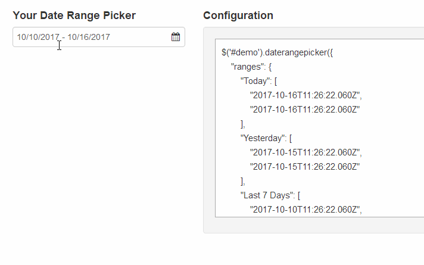

# Plugin Name Badges 

A JavaScript component for choosing date ranges. 
Designed to work with the Bootstrap CSS framework.

## Dome - 演示


## Features - 特性
- One input box
- Quickly
- Easily

## Installation - 安装
```
$ npm install date-range-picker
```

## Requirements - 必备条件
- date-range-picker.css：`Url Address`
- Jquery.js：`Url Address`
- Moment.js：`Url Address`

## Usage - 用法
``` html
<div id="reportrange" class="pull-right" style="background: #fff; cursor: pointer; padding: 5px 10px; border: 1px solid #ccc; width: 100%">
    <i class="glyphicon glyphicon-calendar fa fa-calendar"></i>&nbsp;
    <span></span> <b class="caret"></b>
</div>

<script type="text/javascript">
$(function() {

    var start = moment().subtract(29, 'days');
    var end = moment();

    function cb(start, end) {
        $('#reportrange span').html(start.format('MMMM D, YYYY') + ' - ' + end.format('MMMM D, YYYY'));
    }

    $('#reportrange').daterangepicker({
        startDate: start,
        endDate: end,
        ranges: {
           'Today': [moment(), moment()],
           'Yesterday': [moment().subtract(1, 'days'), moment().subtract(1, 'days')],
           'Last 7 Days': [moment().subtract(6, 'days'), moment()],
           'Last 30 Days': [moment().subtract(29, 'days'), moment()],
           'This Month': [moment().startOf('month'), moment().endOf('month')],
           'Last Month': [moment().subtract(1, 'month').startOf('month'), moment().subtract(1, 'month').endOf('month')]
        }
    }, cb);

    cb(start, end);
    
});
</script>
```

## Options - 属性

| Name      | Type   | Default Value | Description      |
| --------- | ------ | ------------- | ---------------- |
| language  | String | "en-US"       | Language setting |
| startDate | String |               |                  |
| endDate   | String |               |                  |


## Events - 事件

| Name                 | Param | Description                         |
| -------------------- | ----- | ----------------------------------- |
| show.daterangepicker |       | Triggered when the picker is shown  |
| hide.daterangepicker |       | Triggered when the picker is hidden |


## Methods - 方法

| Name         | Param  | Return | Description                              |
| ------------ | ------ | ------ | ---------------------------------------- |
| setStartDate | String |        | Sets the date range picker's currently selected start date to the provided date |
| setEndDate   | String |        | Sets the date range picker's currently selected end date to the provided date |


## Tips - 注意

Something should attention on used it.

## Development - 二次开发

## Authors - 作者

@Hyram

## License - 授权协议

MTI